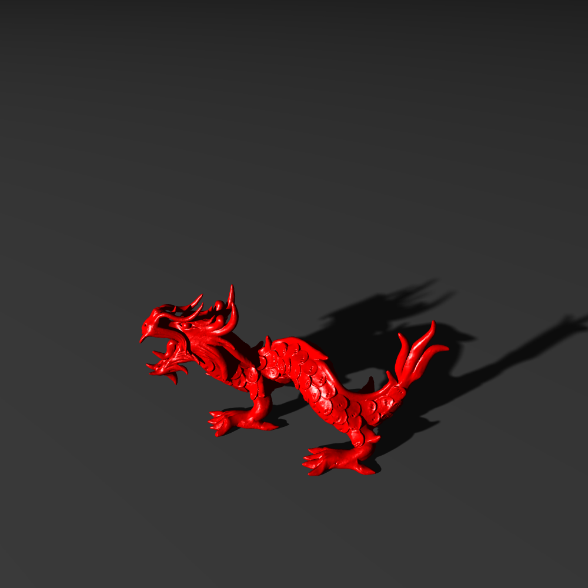
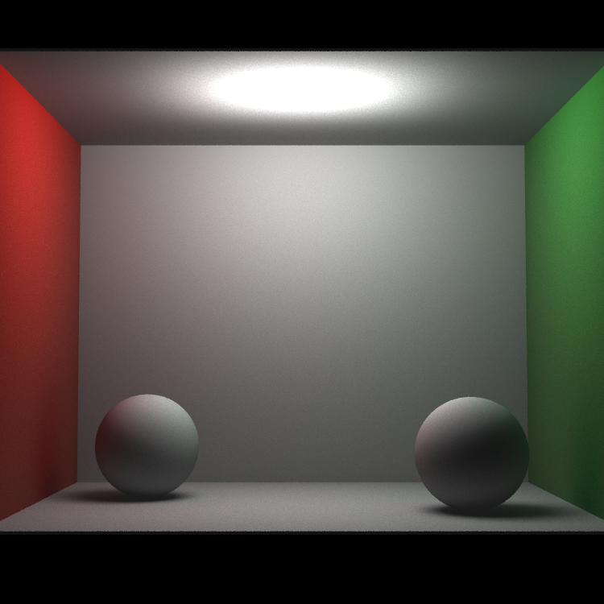
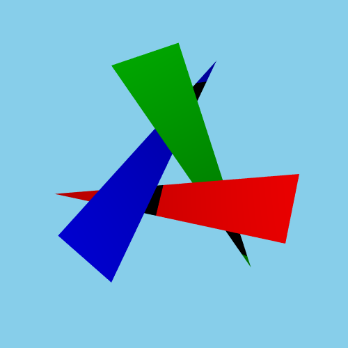
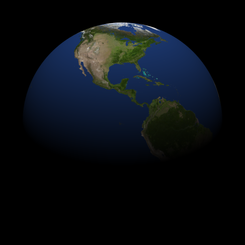
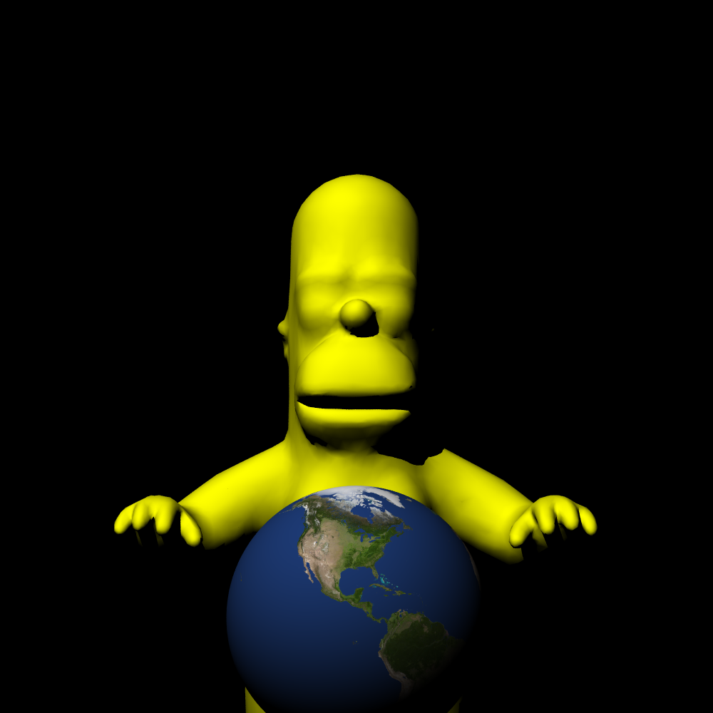

# RustRaytracer

This is a raytracer written in Rust that generates images using various command-line arguments.


 
## Setup

To run the raytracer, follow the steps below:

1. Install Rust: Make sure you have Rust installed on your system. You can download it from the official website: [https://www.rust-lang.org](https://www.rust-lang.org)

2. Clone the repository: Clone this repository to your local machine using Git.
```
git clone https://github.com/NathanPatzer/RustRayTracer.git
```
3. Navigate to the project directory: Use the `cd` command to go into the cloned repository's directory.
```
cd RustRayTracer
```
## Usage
Build the project: Run the following command to build the raytracer.
```
cargo build --release
.\target\release\renderer.exe [Arguments]
```
or for a debug version
```
cargo build
.\target\debug\renderer.exe [Arguments]
```

Run the raytracer: Execute the raytracer with the desired command-line arguments. The available options are as follows:

- `-n [file_name]`: Specifies the name of the image that will be exported. Default to `output.png`
- `-w [width]`: Specifies the width of the output image in pixels. Default value of 500px
- `-h [height]`: Specifies the height of the output image in pixels. If no height is supplied, height = width.
- `-r [Anti-Aliasing-Coefficient]`: Sets the number of ray samples per pixel. Default value of 1.
- `-k [recursion-depth]`: Sets the maximum recursion depth for ray reflections and refractions. Default value of 1.
- `-i [input_file]`: Specifies the input JSON file containing the scene description. Mandatory argument.
- `-t [num_threads]`: Specifies the number of threads that will be used to render the image. Default to 1 and max of 16
- `-s [smoothing]`: dictates whether or not smoothing will be turned on. No arguments.

Output: Once the raytracer finishes execution, the resulting image will be saved in the project directory as `file_name.png`.

## Examples

Here is an few example to help you get started:

- Generate a 500x500 image with an Anti-Aliasing-Coefficient of 4 and using the `threeTriangles.json` file as input:
```
cargo run --release -- -n threeTri -r 4 -i .\SceneData\threeTriangles.json -n threeTri
```


- Generate a 500x500 image with an Anti-Aliasing-Coefficient of 5 and using the `oneEarth.json` file as input:
```
cargo run --release -- -n threeTri -r 5 -i .\SceneData\oneEarth.json -n oneEarth
```

- Generate a 1000x1000 image with Smoothing, Anti-Aliasing-Coefficient of 3 and using the `homer.json` file as input:
```
cargo run --release -- -r 3 -i .\SceneData\homer.json -n homer -s -w 1000
```
